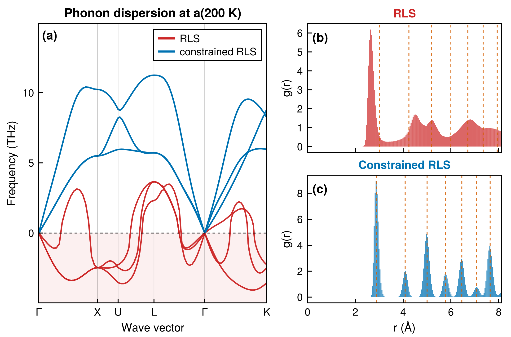

# RLS vs constrained RLS — Al_12_4_6A_2, 200 K

A toy demonstration of what a physical prior alone does, with no POPS committee:
the plain RLS fit against the same fit constrained to have real phonons over the
whole thermal-expansion range, run through NPT at 200 K.



**(a)** phonons of both models at their own a(200 K); **(b)** time-averaged RDF, RLS;
**(c)** time-averaged RDF, constrained RLS. RLS leaves FCC within the run
(⟨coord⟩ 9.46); constrained RLS stays FCC (⟨coord⟩ 12.00). Lattice constants and the
other numbers for the caption are in `fig_200K/metadata.csv`.

## Rerun

From the repository root:

```bash
bash scripts/uq/rls_constrained_pops_Al_12/run_200K.sh replot   # figure from the saved runs, minutes
bash scripts/uq/rls_constrained_pops_Al_12/run_200K.sh all      # everything from scratch → repro_*/, ~2 h on SLURM
```

`replot` needs only the committed θ, NPT summaries and RDFs; the trajectories are needed only if an RDF is missing. Its phonon step builds two
4×4×4 Hessians (about a minute each) if they aren't cached. `all` also needs the design matrix
`models/Al_12_4_6A_2_/A.csv` (tier B) and writes to `repro_results_rls/`, `repro_npt/` and
`repro_fig_200K/`, so it never overwrites the runs behind the figure.

## The steps

| step | script | what it does | output |
|---|---|---|---|
| a) RLS | — | the model's own mean fit | `models/Al_12_4_6A_2_/lin_params.csv` |
| a) constrained RLS | `compare_rls_Al_12_4_6A_2.jl` via `run_constrain.slurm` | RLS objective, with b′(a_eq)·θ = 0 (lattice constant held at a_eq), Born stability, and cutting-plane rows until ω ≥ 0.01 THz on the full band path at a = a_eq × {1.00, 1.02, …, 1.10}, using 5×5×5 force constants. Also plots RLS vs constrained bands at each volume. | `results_rls/theta_rls_constrained.csv`, `results_rls/bands_rls_vs_constrained.png` |
| b) 200 K NPT | `run_npt.slurm` → `npt_al16/npt_member_Al_16.jl` (`MODELDIR=models/Al_12_4_6A_2_`) | 4×4×4 FCC (256 atoms), 0 Pa, Langevin + Monte Carlo barostat, dt 1 fs, friction 0.01 fs⁻¹, 10 000 equilibration + 20 000 production steps, logged every 50. `MD_SEED=1234`, `SEED_MODE=same`: both models see the same random numbers. a(200 K) is the mean of ∛V/4 over production frames. | `npt/<m>/theta_used.csv`, `a0.csv`, `T200K/summary_row.csv`, `T200K/md_trajectory.extxyz` |
| c) RDF | `thermal_expansion_vs_experiment/make_rdf_coordination.jl <npt/m> 200` | the paper figure's RDF producer, unchanged: production frames (step ≥ 10 000), 200 bins to half the smallest box, each frame's own box | `npt/<m>/rdf_200K.csv`, `coordination_200K.csv` |
| d) phonons | `fig_200K_rls_vs_constrained.jl` (`bandpath_Dk`, `bands`, `min_freq_stable` from `scripts/bandpath_phonon_uq/lib.jl`) | 4×4×4 force constants at each model's own a(200 K), dense Γ→K path (20,20,20,20,60), min ω excluding \|q\| < 0.05 | — |
| e) figure | same script | layout and red/blue styling of `thermal_expansion_vs_experiment/fcc_compare_constrained_vs_naive.jl` | `fig_200K/fig_200K_rls_vs_constrained.{pdf,png}` |

## Plot data (`fig_200K/`)

| file | content |
|---|---|
| `bands_rls.csv`, `bands_constrained.csv` | x as plotted and the three branches (THz). x is the constrained model's path coordinate; RLS's is rescaled onto it. That's exact, because \|q\| ∝ 1/a stretches every segment by the same factor. |
| `band_ticks.csv` | high-symmetry labels and their x positions |
| `rdf_rls.csv`, `rdf_constrained.csv` | r (Å), g(r) as plotted |
| `metadata.csv` | per model: a₀, a(200 K) ± std, expansion, ⟨coord⟩, still FCC, min ω, θ file, plus the protocol |

## Notes for the caption

- **RLS lattice constant.** RLS has left FCC at 200 K, so its a(200 K) is ∛V/4 of a transformed
  cell, not an FCC lattice constant. The phonons in (a) are those of an FCC lattice at that
  volume, the same convention as the paper's FCC-compare figure.
- **Phonon cell size.** The constraint was imposed on 5×5×5 force constants; (a) uses 4×4×4 to
  match the paper figure and the MD cell (16.2 Å across at a_eq, more than twice the 6 Å cutoff).
  Panel (a) gives constrained min ω = +0.23 THz. The NPT driver's own check in `summary_row.csv`
  gives +0.353 THz on a coarser path (20 points on every segment), which misses the minimum on
  the dense Γ→K segment.
- **Fit cost.** Constraining costs about 0.2% in weighted training RMSE (2.428 → 2.433, 681 cut rows).
- **Other temperatures.** Constrained RLS also stays FCC at 400 K and, by RDF, at 600 K, but it
  over-expands about 2× relative to experiment (α ≈ 5.4×10⁻⁵ K⁻¹ against ≈ 2.5). See
  `aggregate_npt.jl` and `npt_aT.png`. RLS leaves FCC at every temperature.
- **Earlier exploration**, kept in the original working tree and not shipped to the reproduction repository: `results_rls_2pct/` and `npt/constrained_2pct/` (a
  ±2% constraint, which does not prevent the transformation), and
  `compare_pops_Al_12_4_6A_2.jl` (POPS on RLS vs rejection-sampled POPS on constrained RLS,
  not used for the figure).
